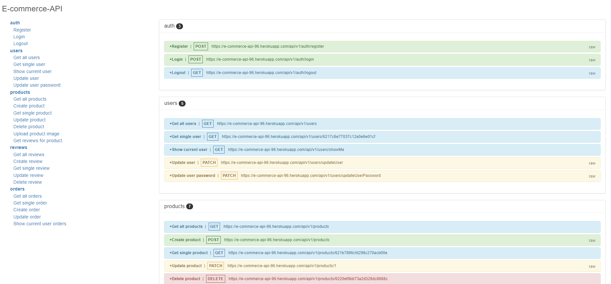

# e-commerce API

Node/Express API with implemented authentication and CRUD operations.

## Swagger documentation - [Swagger](https://e-commerce-api-96.herokuapp.com/)



#### Run The App Locally

```sh
npm i
```
- setup values for - MONGO_URI, JWT_SECRET, JWT_LIFETIME in .env file
```sh
npm start
```
